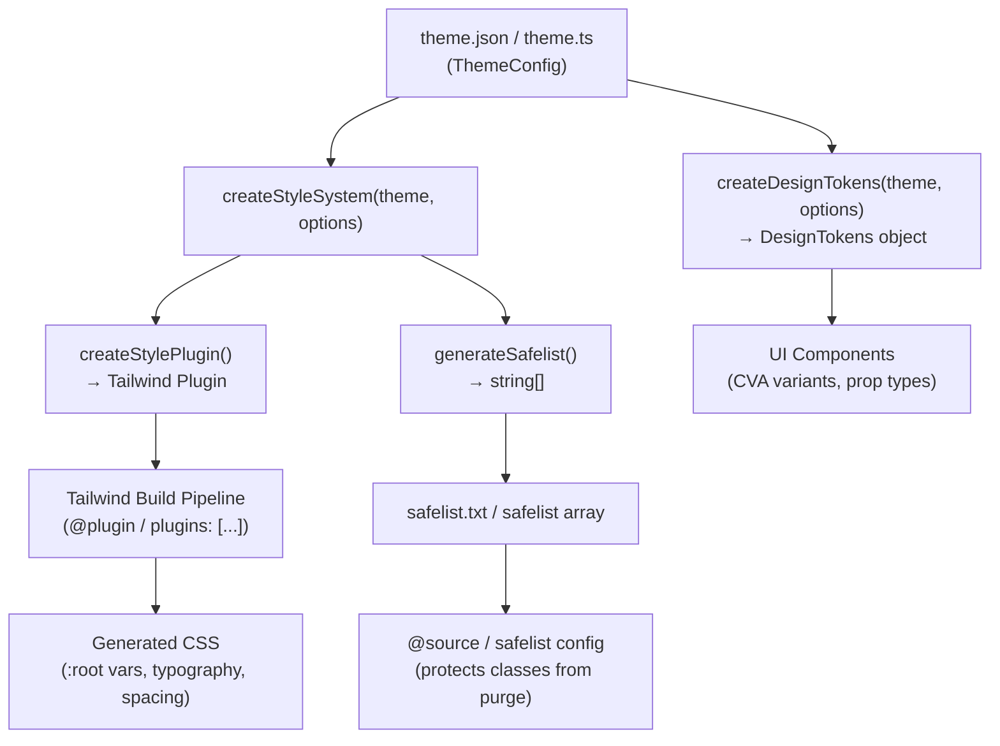
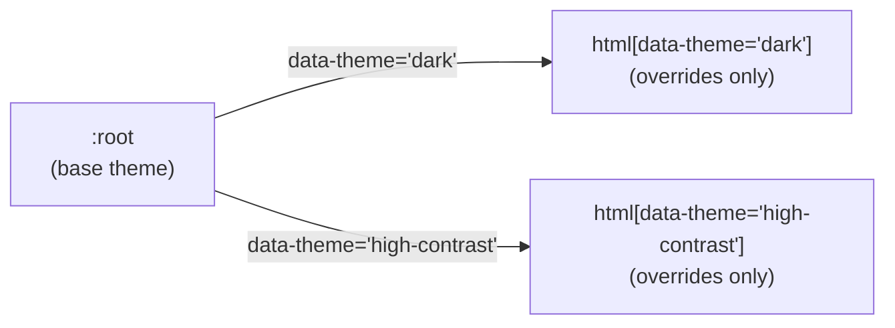

# Architecture

Tài liệu mô tả kiến trúc tổng thể của thư viện `fe-style-generator`.

## Mục lục

- [Architecture](#architecture)
  - [Mục lục](#mục-lục)
  - [Core Concepts](#core-concepts)
  - [Data Flow](#data-flow)
  - [Source Code Structure](#source-code-structure)
  - [Factory Functions](#factory-functions)
    - [`createStyleSystem` _(Khuyến nghị)_](#createstylesystem-khuyến-nghị)
    - [`createStylePlugin`](#createstyleplugin)
    - [`generateSafelist`](#generatesafelist)
    - [`createDesignTokens`](#createdesigntokens)
  - [Multi-theme System](#multi-theme-system)
  - [Spacing System](#spacing-system)
    - [Plugin Output (tự động tạo)](#plugin-output-tự-động-tạo)
    - [Consumer Usage](#consumer-usage)
    - [Ưu điểm](#ưu-điểm)
  - [Exports API](#exports-api)

---

## Core Concepts

| Khái niệm         | Mô tả                                                                                                                |
| ----------------- | -------------------------------------------------------------------------------------------------------------------- |
| **Theme Config**  | Đầu vào duy nhất của hệ thống. Object/JSON định nghĩa `colors`, `typography`, `shadows`, `borderRadius`, `themes`... |
| **Factory**       | Các hàm nhận Theme Config → sinh ra artifact (Plugin, Safelist, Design Tokens)                                       |
| **Plugin**        | Tailwind CSS plugin object — inject CSS variables, typography utilities, spacing rules                               |
| **Safelist**      | Mảng class names được bảo vệ khỏi Tailwind purge                                                                     |
| **Design Tokens** | Object chứa các mảng token keys, dùng trong UI Component logic (CVA, styled-components...)                           |
| **Consumer**      | Project sử dụng thư viện — kết nối plugin vào Tailwind build pipeline                                                |

---

## Data Flow



---

## Source Code Structure

```text
src/
├── index.ts                    # Re-export toàn bộ public API
│
├── factories/                  # Factory functions — sinh ra output chính
│   ├── createStyleSystem.ts    # Entry point khuyến nghị → { plugin, safelist }
│   ├── createStylePlugin.ts    # Tạo Tailwind Plugin (CSS vars + typography + spacing)
│   ├── spacing.ts              # Logic spacing CSS vars (.sp-* + fallback chains)
│   ├── generateSafelist.ts     # Sinh danh sách safelist classes
│   ├── createDesignTokens.ts   # Sinh Design Tokens object cho component
│   └── index.ts
│
├── types/                      # TypeScript type definitions
│   ├── ThemeConfig.ts          # ThemeConfig, ThemeOverride, TypographyConfig
│   ├── Options.ts              # StyleGeneratorOptions, Breakpoint enum, ModuleConfig
│   └── index.ts
│
├── utils/                      # Utilities
│   ├── helpers.ts              # toKebabCase, flattenToVars, mapToVarRefs, addDot...
│   ├── cssVariables.ts         # extractData, buildVarName
│   ├── spacingHelpers.ts       # resolveSpacing, resolveSpacingProps
│   └── index.ts
│
└── constants/                  # Default values
    ├── defaultOption.ts        # DEFAULT_SPACING_PROPERTIES, DEFAULT_LAYOUT_CLASSES...
    ├── safelistProperties.ts   # roundedProperties, borderProperties
    └── index.ts
```

---

## Factory Functions

### `createStyleSystem` _(Khuyến nghị)_

Entry point chính. Tính safelist một lần và truyền vào plugin (tránh tính hai lần).

```typescript
const { plugin, safelist, DesignTokens } = createStyleSystem(theme, options);
// plugin → dùng trong @plugin hoặc plugins: [...]
// safelist → string[] → ghi ra safelist.txt hoặc dùng @source
// DesignTokens → object token hoá để dùng cho tooling/docs/custom build khác
```

### `createStylePlugin`

Tạo Tailwind Plugin instance. Thực hiện:

1. Xây dựng CSS variables cho `:root` và từng `html[data-theme='<name>']`
2. Đăng ký typography utilities (`.text16Medium`, `.text32Bold`...)
3. Sinh spacing CSS custom property rules (`.sp-p`, `.sp-mx`...)
4. Extend Tailwind theme với colors, shadows, borderRadius...

```typescript
// Dùng trực tiếp nếu không cần safelist
const plugin = createStylePlugin(theme, options);
```

### `generateSafelist`

Sinh mảng class names cần safelist (KHÔNG bao gồm spacing — spacing dùng CSS custom props).

```text
Các module được safelist:
1. Layout     → hidden, flex, items-center, justify-between...
2. Rounded    → rounded-md, rounded-lg...
3. Border     → border-0, border-1, border-2...
4. Colors     → text-primary, bg-white, border-main...
5. Typography → text-16-medium, text-32-bold...
6. Shadows    → shadow-sm...
7. Backdrop   → backdrop-blur-sm...
8. Opacity    → opacity-0, opacity-25...
9. Z-Index    → z-0, z-10...
10. Dynamic   → các class user tự thêm
```

### `createDesignTokens`

Trả về object chứa các mảng key từ theme config. Dùng cho component logic, CVA variants, prop type definitions.

```typescript
const { DesignTokens } = createDesignTokens(theme, options);
// DesignTokens.Web.variantColor → ["primary", "white", "main", ...]
// DesignTokens.Web.variantText  → ["text16Medium", "text32Bold", ...]
```

**Type inference:** Hàm dùng Generic `T extends ThemeConfig` kết hợp type utilities (`KebabCase`, `KeysOf`, `LiteralArray`) để preserve literal types thay vì widen sang `string`.

---

## Multi-theme System

Theme config hỗ trợ nhiều theme thông qua key `themes`. Mỗi entry trong `themes` map với `html[data-theme='<name>']`.

**Theme hierarchy:**

- Base config → `:root` (theme mặc định)
- `themes.dark` → `html[data-theme='dark']`
- `themes.<name>` → `html[data-theme='<name>']`

**Cơ chế:** Mỗi theme chỉ cần khai báo values **khác** so với base. CSS variable cascade tự động xử lý fallback.



**Lưu ý quan trọng:** Không còn dùng key `dark` trực tiếp ở top-level. Phải dùng `themes.dark`.

---

## Spacing System

Spacing **không** dùng safelist. Thay vào đó, plugin tạo các utility class cố định `.sp-*` với `var()` fallback chains — hỗ trợ responsive mà không cần generate hàng nghìn class.

### Plugin Output (tự động tạo)

```css
/* Base */
.sp-p {
  padding: var(--sp-p);
}
.sp-mx {
  margin-left: var(--sp-mx);
  margin-right: var(--sp-mx);
}

/* Responsive (mobile-first cascade) */
@media (min-width: 768px) {
  .sp-p {
    padding: var(--sp-p-md, var(--sp-p));
  }
}
@media (min-width: 1024px) {
  .sp-p {
    padding: var(--sp-p-lg, var(--sp-p-md, var(--sp-p)));
  }
}
```

### Consumer Usage

Component dùng `resolveSpacing` / `resolveSpacingProps` để map prop values → CSS variables:

```tsx
const spacing = resolveSpacingProps({ p: 4, mx: { base: 2, md: 4 } });
// classNames: ["sp-p", "sp-mx"]
// style: { "--sp-p": "1rem", "--sp-mx": "0.5rem", "--sp-mx-md": "1rem" }
```

### Ưu điểm

- **Zero safelist** cho spacing — giảm từ ~4,800 xuống còn 0 spacing classes
- **Hỗ trợ giá trị tự do** — không bị giới hạn bởi predefined values
- **Responsive** — mobile-first cascade tự động

---

## Exports API

| Export                  | Loại      | Mô tả                                              |
| ----------------------- | --------- | -------------------------------------------------- |
| `createStyleSystem`     | Function  | Entry point → `{ plugin, safelist, DesignTokens }` |
| `createStylePlugin`     | Function  | Chỉ tạo plugin                                     |
| `generateSafelist`      | Function  | Chỉ sinh safelist array                            |
| `createDesignTokens`    | Function  | Sinh Design Tokens object                          |
| `resolveSpacing`        | Function  | Resolve một spacing prop                           |
| `resolveSpacingProps`   | Function  | Resolve nhiều spacing props                        |
| `Breakpoint`            | Enum      | `SM \| MD \| LG \| XL \| XXL`                      |
| `ThemeConfig`           | Interface | Type cho theme config object                       |
| `StyleGeneratorOptions` | Interface | Type cho options                                   |
| `ModuleConfig`          | Interface | Type cho module config                             |
| `SpacingPropertyMap`    | Type      | Type cho spacing property mapping                  |
