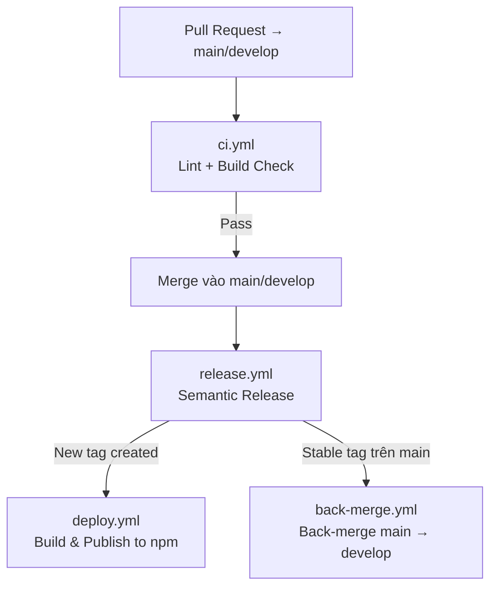

# Deployment & CI/CD

Quy trình deploy thư viện `fe-style-generator`.

## Mục lục

- [Deployment \& CI/CD](#deployment--cicd)
  - [Mục lục](#mục-lục)
  - [CI/CD Overview](#cicd-overview)
  - [GitHub Actions Workflows](#github-actions-workflows)
    - [`ci.yml` — PR Check](#ciyml--pr-check)
    - [Local (Pre-commit) — Husky](#local-pre-commit--husky)
    - [`release.yml` — Semantic Release Orchestrator](#releaseyml--semantic-release-orchestrator)
    - [`deploy.yml` — Build \& Publish](#deployyml--build--publish)
    - [`back-merge.yml` — Back-merge](#back-mergeyml--back-merge)
  - [Branching Strategy](#branching-strategy)
  - [Release Process](#release-process)
    - [Quy trình đúng](#quy-trình-đúng)
  - [Commit Format](#commit-format)
    - [Config](#config)

---

## CI/CD Overview

---

## GitHub Actions Workflows

### `ci.yml` — PR Check

**Trigger:** Pull Request vào `main` hoặc `develop`

**Các bước:**

1. Checkout code
2. Setup Node.js 20 + Yarn cache
3. `yarn install --immutable`
4. `yarn lint` — ESLint check
5. `yarn build` — TypeScript compile + Vite build
6. `yarn test` — Unit testing with **Vitest**
7. `yarn test:types` — Type inference verification

---

### Local (Pre-commit) — Husky

Dự án sử dụng **Husky** và **lint-staged** để chặn các commit không đạt tiêu chuẩn:

- Tự động chạy `lint` và `prettier` cho các file đang thay đổi.
- Chạy `tsc --noEmit` để đảm bảo không lỗi type.
- Chạy `vitest run` cho các unit tests liên quan.

---

### `release.yml` — Semantic Release Orchestrator

**Trigger:** Push vào `main` hoặc `develop`

**Các bước:**

1. Chạy `semantic-release` → tự động tăng version, tạo git tag, cập nhật CHANGELOG
2. So sánh tags trước/sau để phát hiện tag mới
3. Nếu có tag mới → trigger `deploy.yml`
4. Nếu tag stable (không có `-`) và ở `main` → trigger `back-merge.yml`

---

### `deploy.yml` — Build & Publish

**Trigger:** Được gọi từ `release.yml` (workflow_call) khi có release mới

**Các bước:**

1. Checkout tại tag mới
2. `yarn build` → sinh `dist/`
3. Publish lên npm public registry (`registry.npmjs.org`)

---

### `back-merge.yml` — Back-merge

**Trigger:** Được gọi từ `release.yml` sau stable release trên `main`

**Mục đích:** Tự động merge code từ `main` về `develop` sau mỗi stable release, đảm bảo `develop` luôn có đủ commit từ `main`.

---

## Branching Strategy

| Branch      | Mục đích                                         |
| ----------- | ------------------------------------------------ |
| `main`      | Stable releases. Mọi push → trigger release flow |
| `develop`   | Development. Pre-release versions (DEV suffix)   |
| `feature/*` | Feature branches → mở PR vào `develop`           |
| `hotfix/*`  | Hotfix → PR vào cả `main` và `develop`           |

---

## Release Process

> [!IMPORTANT]
> Dự án dùng **semantic-release** — version được tự động tính từ commit messages. **Không cần** tự tay chỉnh `package.json`.
> Muốn publish major `v2.0.0` thay vì tiếp tục `v1.x`, merge commit phải match rule major release.

### Quy trình đúng

1. Code thay đổi trên feature branch
2. Commit theo format `[type] subject` (xem bên dưới)
3. Mở Pull Request vào `develop` (pre-release) hoặc `main` (stable release)
4. CI check pass → merge PR
5. `release.yml` tự động:
   - Tính version mới
   - Tạo git tag (`vX.Y.Z`)
   - Cập nhật `CHANGELOG.md`
   - Trigger `deploy.yml` để publish lên npm

### Required Secrets

- `CI_WORKER_REPOSITORY_TOKEN`: token có quyền push release commit và tag về GitHub repo
- `NPM_TOKEN`: npm granular access token có quyền publish package `@duydpdev/style-generator`

---

## Commit Format

Commit message format: `[type] subject`

| Type                        | Version bump    | Ví dụ                                |
| --------------------------- | --------------- | ------------------------------------ |
| `release`                   | Major (`2.0.0`) | `[release] ship public v2 API`       |
| `feat`                      | Minor (`1.1.0`) | `[feat] add multi-theme support`     |
| `fix`                       | Patch (`1.0.1`) | `[fix] correct spacing var fallback` |
| `perf`                      | Patch (`1.0.1`) | `[perf] improve safelist generation` |
| `docs`, `chore`, `refactor` | Không bump      | `[docs] update architecture guide`   |

### Config

Xem: [`commitlint.config.ts`](commitlint.config.ts) và [`release.config.cjs`](release.config.cjs)
