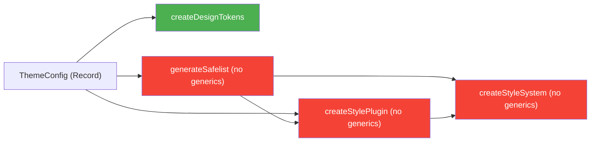
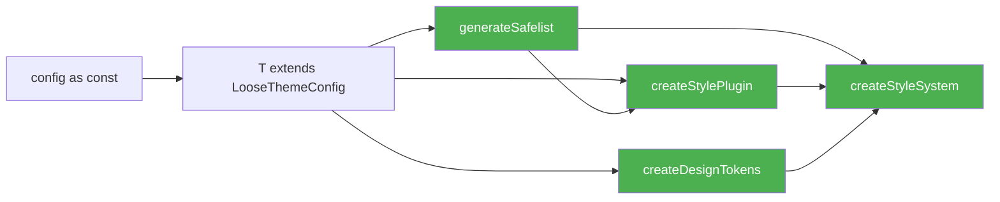

# Plan: Thống nhất TypeScript Type Inference cho fe-style-generator

> **Trạng thái: Draft** _(cập nhật 2026-03-02)_

## Mục tiêu

Đảm bảo **toàn bộ output** của library (`DesignTokens`, `safelist`, `plugin`) có **type inference thống nhất** — khi consumer truyền theme config vào, TypeScript phải:

1. **Giữ literal keys** thay vì widen thành `string` (autocomplete cho `"primary" | "white" | ...`)
2. **Safelist được typed** — consumer biết chính xác safelist chứa những class nào
3. **Một generic flow duy nhất** xuyên suốt `createDesignTokens` → `generateSafelist` → `createStyleSystem`

---

## Phân tích vấn đề hiện tại

### Root Cause

| Vấn đề                                      | Vị trí                 | Giải thích                                               |
| ------------------------------------------- | ---------------------- | -------------------------------------------------------- |
| `ThemeConfig` dùng `Record<string, string>` | `ThemeConfig.ts`       | TS widen literal keys → mất autocomplete                 |
| `generateSafelist` không có generics        | `generateSafelist.ts`  | Return type cố định `string[]` — không infer class names |
| `createStyleSystem` không có generics       | `createStyleSystem.ts` | Không flow type từ config → output                       |
| `createStylePlugin` return `unknown`        | `createStylePlugin.ts` | Mất type info hoàn toàn                                  |

### Data flow hiện tại



> **Chỉ `createDesignTokens` có generic inference, còn lại đều mất type.**

---

## Giải pháp: Unified Generic Flow

### Nguyên tắc thiết kế

1. **Một `LooseThemeConfig` constraint** — dùng `Record<string, any>` thay vì `Record<string, string>` để TS không widen
2. **Generic `T` flow xuyên suốt** — tất cả function chính đều nhận `T extends LooseThemeConfig`
3. **Type utilities tập trung** — đặt trong `src/types/inference.ts`, không scatter trong factory files
4. **`ThemeConfig` giữ nguyên** — vẫn dùng cho documentation/validation, nhưng **không dùng làm generic constraint**

### Data flow mới



---

## Proposed Changes

### Bổ sung: Typed safelist cho CVA / design token

**Vấn đề cụ thể cần giải quyết**

- Safelist hiện tại đã được generate đúng theo `ThemeConfig`, nhưng:
  - TypeScript chỉ thấy `string[]` → **không gợi ý design token** dựa trên theme.
  - Khi define variants với `cva` (hoặc bất kỳ variant system nào), dev không có autocomplete cho các token như `"primary"`, `"text16Medium"`, `"sm"`...

**Nguyên tắc cho phần này**

- Không thay đổi behavior runtime của `generateSafelist` (vẫn trả về `string[]` dùng cho Tailwind).
- Bổ sung **layer type-level** để:
  - Có thể suy ra union type các token từ `theme` (re‑use `InferColorKeys`, `InferTypographyKeys`, ...).
  - Dùng được cho:
    - `DesignTokens` (đã đề cập phía dưới).
    - **CVA variants**: `type ColorVariant<T> = (typeof DesignTokens<T>["Web"]["variantColor"])[number];`

**Chi tiết design cho typed safelist / CVA**

- Tạo thêm type helpers trong `inference.ts`:
  - `export type ColorToken<T extends LooseThemeConfig> = InferColorKeys<T>;`
  - `export type TypographyToken<T extends LooseThemeConfig> = InferTypographyKeys<T>;`
  - `export type ShadowToken<T extends LooseThemeConfig> = InferShadowKeys<T>;`
  - ... (tương tự cho `border`, `backDropBlurs`, `borderRadius` nếu cần).
- Từ đó, định nghĩa type phục vụ CVA:
  - `export type VariantColor<T extends LooseThemeConfig> = ColorToken<T>;`
  - `export type VariantText<T extends LooseThemeConfig> = TypographyToken<T>;`
  - `export type VariantShadow<T extends LooseThemeConfig> = ShadowToken<T>;`
- Document pattern dùng với `cva`:
  - Consumer truyền `theme` vào `createStyleSystem(theme)` → TS infer `T`.
  - Dùng `VariantColor<typeof theme>` / `VariantText<typeof theme>` để:
    - Define `variants` object trong `cva` (đảm bảo key hợp lệ).
    - Hoặc annotate props component: `color?: VariantColor<typeof theme>;`

**Ví dụ usage (ở docs, không cần code thực thi trong lib)**

- Trong docs, minh họa:
  - `type ButtonColor = VariantColor<typeof theme>;`
  - Khi gõ `const Button = ({ color }: { color: ButtonColor }) => { ... }`,
    VSCode phải gợi ý `"primary" | "white" | "main" | "secondary"`.
  - Khi define `cva`, dùng `satisfies Record<ButtonColor, string>` để đảm bảo đủ key cho từng token.

### Component 1: Type System (không dùng `any`, trả type đầy đủ)

#### [NEW] [inference.ts](file:///Users/phanduy/workspaces/github.com/duydp.dev/template/fe-style-generator/src/types/inference.ts)

Tập trung tất cả type utilities dùng cho inference. **Không dùng `any`** – chỉ dùng `unknown` hoặc generic cụ thể:

```ts
// ---- Loose constraint (không widen literals, không dùng any) ----

/** Generic constraint lỏng — thay thế ThemeConfig trong function signatures */
export interface LooseThemeConfig<
  TColorsBase extends Record<string, unknown> = Record<string, unknown>,
  TColorsText extends Record<string, unknown> = Record<string, unknown>,
  TTypography extends Record<string, unknown> = Record<string, unknown>,
  TShadows extends Record<string, unknown> | undefined = Record<
    string,
    unknown
  >,
  TBackdropBlurs extends Record<string, unknown> | undefined = Record<
    string,
    unknown
  >,
  TBorderRadius extends Record<string, unknown> | undefined = Record<
    string,
    unknown
  >,
  TBorder extends Record<string, unknown> | undefined = Record<string, unknown>,
  TThemes extends Record<string, unknown> | undefined = Record<string, unknown>,
> {
  colors: { base: TColorsBase; text: TColorsText };
  typography: TTypography;
  shadows?: TShadows;
  backDropBlurs?: TBackdropBlurs;
  borderRadius?: TBorderRadius;
  border?: TBorder;
  themes?: TThemes;
}

// ---- Type utilities ----

/** CamelCase → kebab-case ở type-level */
export type KebabCase<S extends string> = S extends `${infer T}${infer U}`
  ? U extends Uncapitalize<U>
    ? `${Uncapitalize<T>}${KebabCase<U>}`
    : `${Uncapitalize<T>}-${KebabCase<U>}`
  : S;

/** Extract keys an toàn từ object type (trả never nếu undefined) */
export type KeysOf<T> = T extends object ? keyof T : never;

/** Extract string keys dưới dạng union */
export type StringKeysOf<T> = Extract<KeysOf<T>, string>;

// ---- Inferred result types (đầy đủ, không tách lẻ từng variant) ----

/** Infer color keys từ theme config (base + text, kebab-cased) */
export type InferColorKeys<T extends LooseThemeConfig> = KebabCase<
  Extract<keyof T["colors"]["base"] | keyof T["colors"]["text"], string>
>;

/** Infer typography keys từ theme config */
export type InferTypographyKeys<T extends LooseThemeConfig> = StringKeysOf<
  T["typography"]
>;

/** Infer shadow keys */
export type InferShadowKeys<T extends LooseThemeConfig> = StringKeysOf<
  NonNullable<T["shadows"]>
>;

/** Infer backdrop blur keys */
export type InferBackdropBlurKeys<T extends LooseThemeConfig> = StringKeysOf<
  NonNullable<T["backDropBlurs"]>
>;

/** Infer border radius keys */
export type InferBorderRadiusKeys<T extends LooseThemeConfig> = StringKeysOf<
  NonNullable<T["borderRadius"]>
>;

/** Infer border keys */
export type InferBorderKeys<T extends LooseThemeConfig> = StringKeysOf<
  NonNullable<T["border"]>
>;

/** Typed safelist: toàn bộ classnames dựa theo theme T (không chỉ color/text) */
export type InferSafelistClasses<T extends LooseThemeConfig> =
  | `text-${InferColorKeys<T>}`
  | `bg-${InferColorKeys<T>}`
  | `border-${InferColorKeys<T>}`
  | `shadow-${InferShadowKeys<T>}`
  | `backdrop-blur-${InferBackdropBlurKeys<T>}`
  // spacing, layout, rounded, opacity, zIndex... sẽ được bổ sung dựa trên constants/options
  | string; // fallback cho các class không bắt nguồn từ theme (dynamicClasses, layout cố định, v.v.)
```

#### [MODIFY] [ThemeConfig.ts](file:///Users/phanduy/workspaces/github.com/duydp.dev/template/fe-style-generator/src/types/ThemeConfig.ts)

- Giữ nguyên `ThemeConfig` interface (dùng cho documentation/runtime validation)
- **Không thay đổi gì** — chỉ đảm bảo `ThemeConfig` vẫn export bình thường

#### [MODIFY] [index.ts (types)](file:///Users/phanduy/workspaces/github.com/duydp.dev/template/fe-style-generator/src/types/index.ts)

Thêm re-export cho `inference.ts`:

```diff
 export * from "./ThemeConfig";
 export * from "./Options";
+export * from "./inference";
```

---

### Component 2: Factory Functions

#### [MODIFY] [createDesignTokens.ts](file:///Users/phanduy/workspaces/github.com/duydp.dev/template/fe-style-generator/src/factories/createDesignTokens.ts)

- **Xóa** type utilities inline (`KebabCase`, `LiteralArray`, `KeysOf`) — chuyển sang import từ `inference.ts`
- **Đổi constraint** từ `T extends ThemeConfig` → `T extends LooseThemeConfig`
- **Strongly type return value** — define return type rõ ràng dùng inferred types

```ts
import type {
  LooseThemeConfig,
  KebabCase,
  StringKeysOf,
  InferColorKeys,
} from "../types";

export const createDesignTokens = <T extends LooseThemeConfig>(
  config: T,
  options: StyleGeneratorOptions = {},
) => {
  // ... logic giữ nguyên, return type tự infer đúng nhờ LooseThemeConfig
};
```

#### [MODIFY] [generateSafelist.ts](file:///Users/phanduy/workspaces/github.com/duydp.dev/template/fe-style-generator/src/factories/generateSafelist.ts)

- **Thêm generic** `<T extends LooseThemeConfig>`
- **Return type có type đầy đủ**, không chỉ `string[]`:

```ts
import type { LooseThemeConfig, InferSafelistClasses } from "../types";

export const generateSafelist = <T extends LooseThemeConfig>(
  config: T,
  options: StyleGeneratorOptions = {},
): InferSafelistClasses<T>[] => {
  const result: string[] = [];
  // ... logic hiện tại giữ nguyên, build ra mảng string

  // Cast một lần ở cuối sang type-level union đã tính toán:
  return [...new Set(result)] as InferSafelistClasses<T>[];
};
```

#### [MODIFY] [createStylePlugin.ts](file:///Users/phanduy/workspaces/github.com/duydp.dev/template/fe-style-generator/src/factories/createStylePlugin.ts)

- **Thêm generic** `<T extends LooseThemeConfig>`
- Return type giữ nguyên (Tailwind plugin instance)

```ts
export const createStylePlugin = <T extends LooseThemeConfig>(
  config: T,
  options: StyleGeneratorOptions = {},
  safelist?: string[],
): unknown => { ... };
```

#### [MODIFY] [createStyleSystem.ts](file:///Users/phanduy/workspaces/github.com/duydp.dev/template/fe-style-generator/src/factories/createStyleSystem.ts)

- **Thêm generic** `<T extends LooseThemeConfig>`
- **Gọi `createDesignTokens<T>`** → trả về `DesignTokens` đã typed đầy đủ (không tách lẻ chỉ `variantColor`/`variantText`).
- **Safelist cũng được typed đầy đủ** theo `InferSafelistClasses<T>`.
- **Đây là entry point chính** — consumer chỉ cần gọi 1 function:

```ts
import type { LooseThemeConfig, InferSafelistClasses } from "../types";

export interface StyleSystemResult<T extends LooseThemeConfig> {
  plugin: unknown;
  safelist: InferSafelistClasses<T>[];
  DesignTokens: {
    Web: {
      // ví dụ, tuỳ theo implementation thực tế:
      variant: readonly string[]; // tổng hợp
      variantColor: readonly InferColorKeys<T>[];
      variantText: readonly InferTypographyKeys<T>[];
      variantShadow: readonly InferShadowKeys<T>[];
      // ... các nhóm khác nếu cần
    };
  };
}

export const createStyleSystem = <T extends LooseThemeConfig>(
  config: T,
  options: StyleGeneratorOptions = {},
): StyleSystemResult<T> => {
  const safelist = generateSafelist<T>(config, options);
  const { DesignTokens } = createDesignTokens<T>(config, options);

  return {
    plugin: createStylePlugin<T>(config, options, safelist),
    safelist,
    DesignTokens,
  };
};
```

> [!IMPORTANT]
> Toàn bộ type (safelist + DesignTokens) được suy ra từ `T` một lần, **không dùng `any`**, không thiết kế helper tách lẻ kiểu `VariantColor<T>`, `VariantText<T>` bên ngoài. Consumer có thể tự derive nếu cần:
>
> ```ts
> type ColorToken<T extends LooseThemeConfig> = InferColorKeys<T>;
> ```

---

### Component 3: Consumer Usage

Sau khi refactor, consumer sử dụng như sau:

```ts
// theme.ts — dùng `as const` hoặc satisfies
const theme = {
  colors: {
    base: { primary: "#007AFF", white: "#FFFFFF" },
    text: { main: "#1C1C20", secondary: "#8E8E93" },
  },
  typography: {
    text16Medium: {
      fontSize: "16px",
      fontWeight: 500,
      lineHeight: "150%",
      letterSpacing: "0px",
    },
  },
  shadows: { sm: "0 1px 2px rgba(0,0,0,0.1)" },
} as const;

export default theme;
```

```ts
// tailwind.config.ts
import theme from "./theme";
import { createStyleSystem } from "@duydpdev/style-generator";

const { plugin, safelist, DesignTokens } = createStyleSystem(theme);

// ✅ DesignTokens.Web.variantColor → ("primary" | "white" | "main" | "secondary")[]
// ✅ DesignTokens.Web.variantText → ("text16Medium")[]
// ✅ DesignTokens.Web.variantShadow → ("sm")[]
// ✅ Autocomplete hoạt động đầy đủ
```

> [!NOTE]
> **JSON config**: Nếu consumer dùng `theme.json`, cần `import theme from "./theme.json"` kết hợp `as const`:
>
> ```ts
> import rawTheme from "./theme.json";
> const { DesignTokens } = createStyleSystem(rawTheme as const);
> ```
>
> TypeScript 5.x với `resolveJsonModule: true` sẽ infer literal types từ JSON.

---

## Verification Plan

### 1. Type check — compiler

```bash
cd /Users/phanduy/workspaces/github.com/duydp.dev/template/fe-style-generator
npx tsc --noEmit
```

**Expected**: Không có type error.

### 2. Type test — tạo file test inference

Tạo file `examples/test-inference.ts` để verify autocomplete:

```ts
import { createDesignTokens, createStyleSystem } from "../src";

const theme = {
  colors: {
    base: { primary: "#007AFF", white: "#FFF" },
    text: { main: "#000", secondary: "#888" },
  },
  typography: {
    heading1: {
      fontSize: "32px",
      fontWeight: 700,
      lineHeight: "120%",
      letterSpacing: "0px",
    },
    body: {
      fontSize: "16px",
      fontWeight: 400,
      lineHeight: "150%",
      letterSpacing: "0px",
    },
  },
  shadows: {
    sm: "0 1px 2px rgba(0,0,0,0.1)",
    lg: "0 4px 12px rgba(0,0,0,0.15)",
  },
} as const;

// Test createStyleSystem — entry chính: plugin, safelist, DesignTokens đã typed
const { plugin, safelist, DesignTokens } = createStyleSystem(theme);

// ✅ Đây là "type tổng" cho design token color (literal union, không phải string)
type ColorToken = (typeof DesignTokens.Web.variantColor)[number];
//   ^? "primary" | "white" | "main" | "secondary"

// ✅ "type tổng" cho text token
type TextToken = (typeof DesignTokens.Web.variantText)[number];
//   ^? "heading1" | "body"

// ✅ "type tổng" cho shadow token
type ShadowToken = (typeof DesignTokens.Web.variantShadow)[number];
//   ^? "sm" | "lg"

// ✅ Phải báo lỗi với value không hợp lệ
// @ts-expect-error — "invalid" is not a valid color
const _badColor: ColorToken = "invalid";

// ✅ Phải pass với value hợp lệ
const _goodColor: ColorToken = "primary";
//   ^? "primary" | "white" | "main" | "secondary"  (giống ColorType)
```

Chạy verify:

```bash
npx tsc --noEmit
```

**Expected**: Chỉ có error ở dòng `@ts-expect-error`, không có error nào khác.

### 3. Kiểm tra thủ công autocomplete

Mở file `examples/test-inference.ts` trong VS Code, gõ `const x: ColorType = "` và verify popup autocomplete hiện đúng `"primary" | "white" | "main" | "secondary"`.
